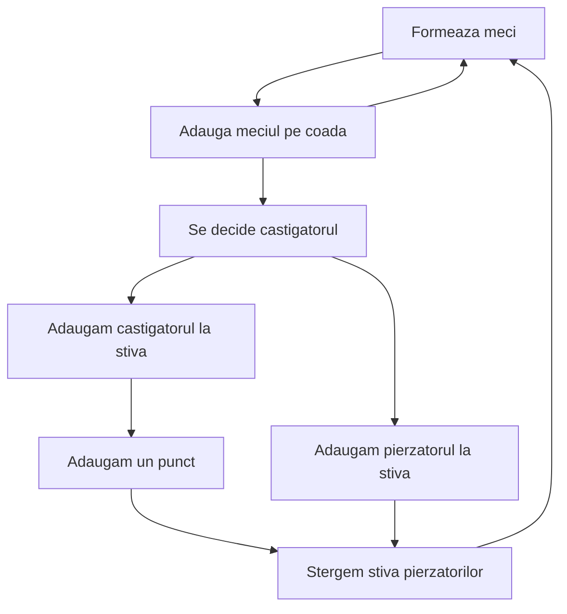

```mermaid
    flowchart
        FORM["Formeaza meci"]
        FORM-->ADD
        ADD["Adauga meciul pe coada"]
        ADD-->FORM
        ADD-->DECIDE
        DECIDE["Se decide castigatorul"]
        WIN["Adaugam castigatorul la stiva"]
        POINT["Adaugam un punct"]
        LOSE["Adaugam pierzatorul la stiva"]
        DECIDE-->WIN-->POINT
        DECIDE-->LOSE
        DELETE["Stergem stiva pierzatorilor"]
        POINT-->DELETE
        LOSE-->DELETE
        DELETE-->FORM
```