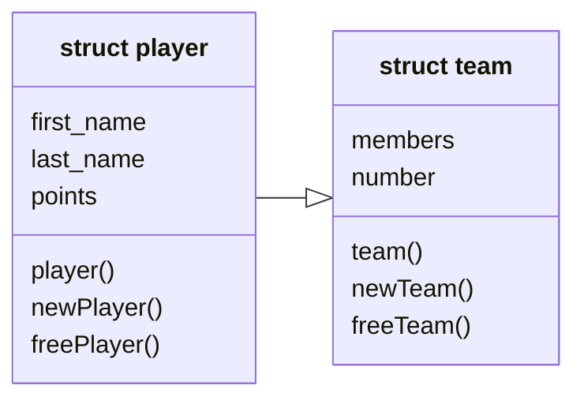

# data.h

Biblioteca utilizata pentru a stoca si
procesa datele de baza din fiserul de
intrare. Pentru fiecare structura se
pun la dispozitie un **constructor** pe stack,
unul pe heap si un **destructor** pentru heap.

